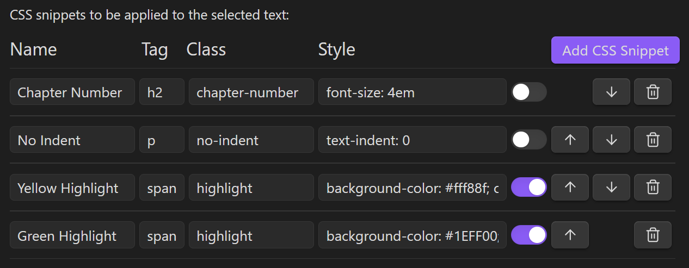
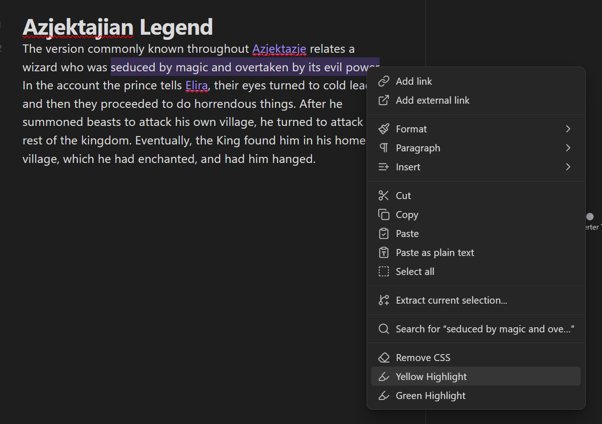
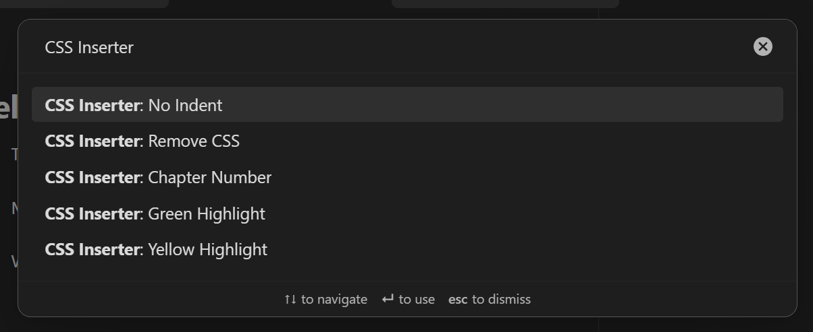
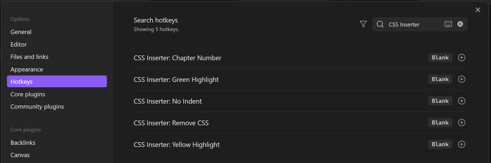

# About CSS Inserter
Inserts user-defined css snippets into the selected text.
This is a fork of [Style Text](https://github.com/juanjoarranz/style-text-obsidian-plugin) by [Juanjo Arranz](https://github.com/juanjoarranz).

The main difference between this plugin and [Style Text](https://github.com/juanjoarranz/style-text-obsidian-plugin) is that with CSS Inserter you can specify the html tag, the class, and the style for each CSS snippet.

This plugin requires basic knowledge of CSS. Links on how to format each setting are found below.

# Instructions
## Setting Up CSS Snippets
After installing the plugin, first go to the settings panel and set up your CSS snippets the way you want. Give your snippet a **name** and specify the **tag**, the **class**, and the **style** you want the snippet to apply.

[Click here](https://www.w3schools.com/tags/default.asp) for a list of HTML tags to use. And here is a [guide](https://www.w3schools.com/html/html_styles.asp) on how to format the "style" part of the CSS snippet. Everything within the quotes following "style=" should be entered in the CSS snippet.

You can re-order snippets by pressing the up and down arrow buttons next to the snippet, or delete the entire snippet by pressing the trash bin button.

The toggle option next to the snippet disables/enables showing the CSS snippet in the context menu after you right click your selected text.
## Applying CSS Snippets
To apply the CSS snippet, first go to edit mode and select the text you want to apply the snippet to.

After you do that, there are three ways you can apply a CSS snippet:
### 1. Context Menu
After selecting your desired text, right click on the note. Enabled snippets will appear in the context menu. You can click the snippet you would like to apply to the selected text.

### 2. Command Palette
After selecting your desired text, open the command palette (`Ctrl + P`) and search for the CSS snippet you'd like to apply.

Use your `ARROW UP` and `ARROW DOWN` keys to navigate to the snippet you want, and then press `ENTER` to select it.
Alternatively, you can just use your mouse to click on the desired selection.

After doing so, the snippet will be applied to the selected text.

### 3. Hotkeys
Prior to selecting the text, you can go to the hotkeys tab in your Obsidian settings beforehand and add a hotkey for each CSS snippet.

After setting these up, select your desired text, and press the hotkey combination you previously set up for the CSS snippet of your choice. The snippet will be applied to the selected text.
## Removing CSS Snippets
You can remove the CSS snippet after selecting it. Clicking on the CSS-ified text the first time will automatically select the entire text for you.

After you select the CSS-ified text, you can remove the CSS from the text by any of the three methods:
 1. Right click on the note and select "Remove CSS" from the context menu (see [Context Menu](#1-context-menu)).
 2. Open the Command Palette (`Ctrl + P`) and select the "CSS Inserter: Remove CSS" command (see [Command Palette](#2-command-palette)).
 3. Set up a hotkey prior in your Obsidian settings. Afterward, select the text and press the hotkey (see [Hotkeys](#3-hotkeys)).
