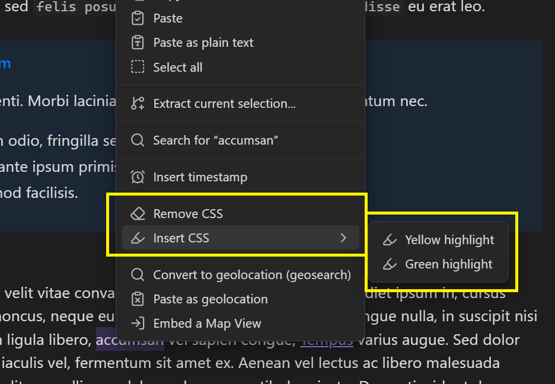

# About CSS Inserter
This is a plugin for [Obsidian](https://obsidian.md/) that inserts user-defined css snippets into the selected text.

This plugin is a fork of [Style Text](https://github.com/juanjoarranz/style-text-obsidian-plugin) by [Juanjo Arranz](https://github.com/juanjoarranz).

The main difference between this plugin and [Style Text](https://github.com/juanjoarranz/style-text-obsidian-plugin) is that with CSS Inserter you can specify the html tag, the class, and the style for each CSS snippet.

This plugin requires basic knowledge of CSS. Links on how to format each setting can be found under [Set up CSS snippets](#set-up-css-snippets).

# Instructions
## Set up CSS snippets
After installing the plugin, first go to **Settings → CSS Inserter** and set up your CSS snippets the way you want.

Give your snippet a **name** and specify the HTML **tag**, the **class**, and the **style** you want the snippet to apply. Only a **name** and a **tag** are required. If you do not want to use the other options, leave them blank.

> Here is a list of [HTML tags](https://www.w3schools.com/tags/default.asp) to use.
> 
> And here is a [guide](https://www.w3schools.com/html/html_styles.asp) on how to format the **style** part of the CSS snippet.
> Everything within the quotes following `style=` should be entered in the CSS snippet.

</img>

You can re-order snippets by pressing the **up arrow** ( <svg xmlns="http://www.w3.org/2000/svg" width="18" height="18" viewBox="0 0 24 24" fill="none" stroke="currentColor" stroke-width="1.5" stroke-linecap="round" stroke-linejoin="round" class="lucide lucide-arrow-up" anchor="icon"><path d="m5 12 7-7 7 7"/><path d="M12 19V5"/></svg> ) and **down arrow** ( <svg xmlns="http://www.w3.org/2000/svg" width="18" height="18" viewBox="0 0 24 24" fill="none" stroke="currentColor" stroke-width="1.5" stroke-linecap="round" stroke-linejoin="round" class="lucide lucide-arrow-down" anchor="icon"><path d="M12 5v14"/><path d="m19 12-7 7-7-7"/></svg> ) buttons next to the snippet, or delete the entire snippet by pressing the **trash bin** ( <svg xmlns="http://www.w3.org/2000/svg" width="18" height="18" viewBox="0 0 24 24" fill="none" stroke="currentColor" stroke-width="1.5" stroke-linecap="round" stroke-linejoin="round" class="lucide lucide-trash-2"><path d="M3 6h18"/><path d="M19 6v14c0 1-1 2-2 2H7c-1 0-2-1-2-2V6"/><path d="M8 6V4c0-1 1-2 2-2h4c1 0 2 1 2 2v2"/><line x1="10" x2="10" y1="11" y2="17"/><line x1="14" x2="14" y1="11" y2="17"/></svg> ) button.

The **toggle** option next to the snippet disables/enables showing the CSS snippet in the **Context menu**.

## Apply and Remove CSS snippets
To apply or remove a CSS snippet, first go into **Edit mode** and select the text you want to apply the snippet to or remove the snippet from. The first time you select text that already has CSS snippets applied, the entire text will automatically be selected for you.

After you do that, there are three ways you can apply or remove a CSS snippet:
 1. On desktop: Right-click the note to open the **Context menu**. Enabled snippets will appear there. Select the snippet you want to apply, or select "Remove CSS" to remove the applied CSS snippet. 
    </img>
 2. Open the **Command palette** and search for and select the CSS style you'd like to apply, or perform the "CSS Inserter: Remove CSS" command to remove the CSS snippet (see [Command palette](https://help.obsidian.md/Plugins/Command+palette)).
 3. Set up a **Hotkey** prior for your desired CSS snippet (or for the "CSS Inserter: Remove CSS" command if you want to remove the CSS) in **Settings → CSS Inserter**. Afterward, select the text and perform the **Hotkey** (see [Hotkeys](https://help.obsidian.md/User+interface/Hotkeys)).
